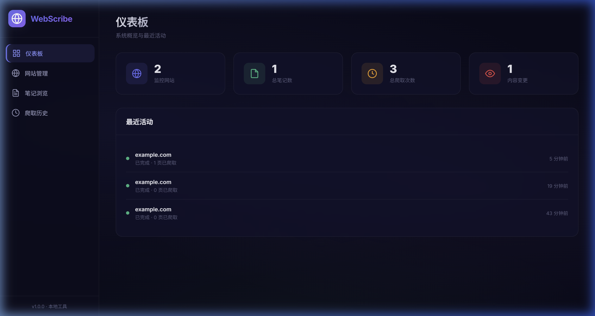
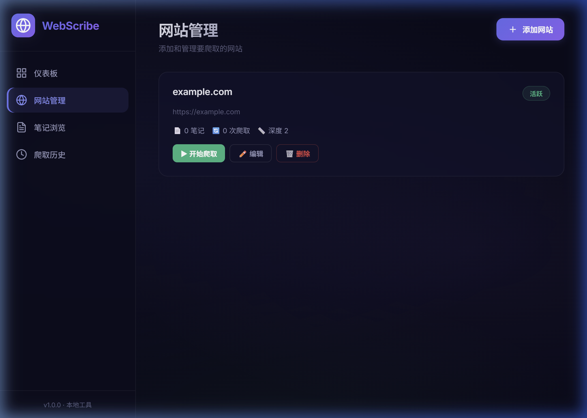
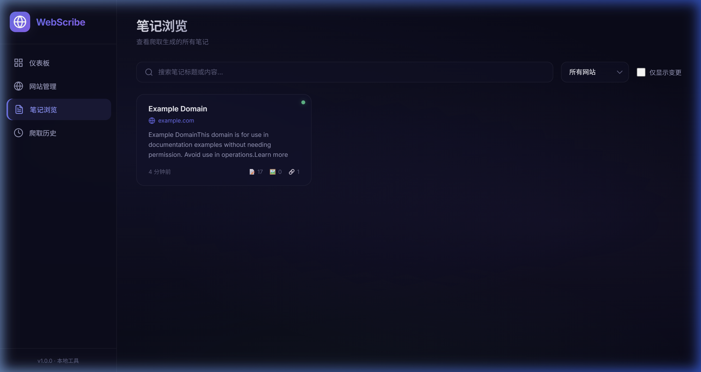
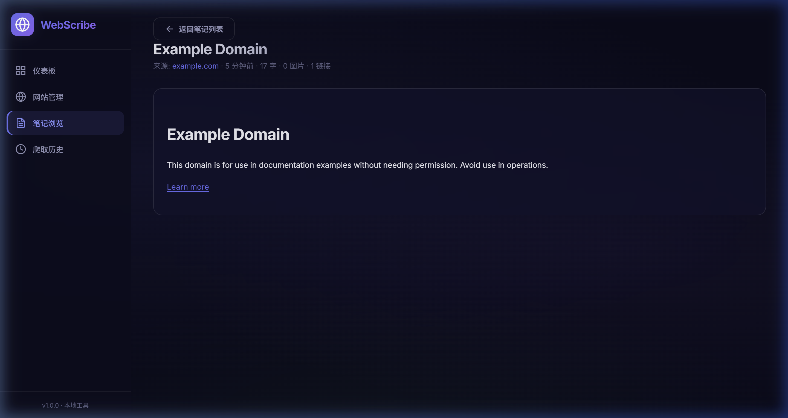

<div align="center">

# 🕸️ WebScribe

**智能网页爬虫笔记系统**

轻量级、本地化的网页内容采集与管理工具
自动爬取 · 定时监控 · 变更追踪 · HTML 笔记

[](https://nodejs.org/)
[](https://expressjs.com/)
[](https://sql.js.org/)
[](LICENSE)

</div>

---

## 📸 界面预览

<table>
  <tr>
    <td align="center"><b>📊 仪表板</b></td>
    <td align="center"><b>🌐 网站管理</b></td>
  </tr>
  <tr>
    <td></td>
    <td></td>
  </tr>
  <tr>
    <td align="center"><b>📝 笔记浏览</b></td>
    <td align="center"><b>📄 笔记详情</b></td>
  </tr>
  <tr>
    <td></td>
    <td></td>
  </tr>
</table>

---

## ✨ 功能特性

### 🔍 智能递归爬取

- **深度可控**：支持 0-5 级递归深度，灵活控制爬取范围
- **同域过滤**：自动识别并跟踪同域名下的子链接，不会跳出目标网站
- **智能内容提取**：优先识别 `<main>`、`<article>` 等语义化标签，精准提取正文内容
- **HTML 消毒**：自动移除 `<script>`、事件处理器等危险内容，确保笔记安全可读
- **请求伪装**：模拟真实浏览器请求头，有效绕过基础反爬机制
- **文件过滤**：自动跳过 PDF、图片、视频等非 HTML 资源，节省带宽与时间

### ⏰ 定时自动更新

- **Cron 表达式**：使用标准 Cron 语法定义爬取计划，精确到分钟级别
- **预设模板**：提供常用时间间隔（每 30 分钟 / 每小时 / 每天 / 每周）一键选择
- **冲突保护**：同一网站不会同时执行多个爬取任务，避免资源浪费
- **动态管理**：支持随时启用/停用/修改定时计划，无需重启服务

### 📝 笔记管理系统

- **自动生成**：每次爬取自动将网页内容转化为结构化 HTML 笔记
- **元数据记录**：保存标题、meta 描述、关键词、字数、图片数、链接数等信息
- **全文搜索**：支持按标题和内容关键词搜索笔记
- **来源筛选**：按网站来源过滤笔记，快速定位目标内容
- **分页浏览**：内置分页机制，轻松管理大量笔记

### 🔄 变更检测与追踪

- **内容对比**：自动比对每次爬取的内容与历史版本，标记变更页面
- **变更过滤**：一键筛选有内容更新的笔记，快速掌握网站动态
- **爬取历史**：完整记录每次爬取的时间、页数、状态，支持回溯查看

### 🎨 现代化 UI 设计

- **暗色主题**：精心调配的暗色系配色方案，长时间使用不伤眼
- **玻璃拟态**：采用 Glassmorphism 设计语言，界面层次分明
- **微动效**：丰富的悬停效果、过渡动画和状态反馈，交互体验流畅
- **响应式布局**：自适应不同屏幕尺寸
- **SPA 架构**：单页应用，页面切换无刷新，操作丝滑

---

## 🏗️ 技术架构

```
┌─────────────────────────────────────────────┐
│              Frontend (SPA)                  │
│         HTML / CSS / Vanilla JS              │
├─────────────────────────────────────────────┤
│              REST API Layer                  │
│            Express.js Server                 │
├──────────┬──────────┬───────────────────────┤
│  Scraper │ Scheduler│    Route Handlers      │
│  Engine  │ (Cron)   │  Sites / Notes / Stats │
├──────────┴──────────┴───────────────────────┤
│              Data Layer                      │
│         SQLite (via sql.js/WASM)             │
└─────────────────────────────────────────────┘
```

| 组件 | 技术 | 用途 |
|------|------|------|
| **Web 服务器** | Express.js 4.x | RESTful API + 静态文件服务 |
| **爬虫引擎** | Axios + Cheerio | HTTP 请求 + HTML 解析与内容提取 |
| **数据库** | sql.js (SQLite WASM) | 零依赖本地持久化存储 |
| **定时任务** | node-cron | Cron 表达式调度器 |
| **前端** | 原生 HTML/CSS/JS | 无框架依赖，轻量快速 |

---

## 🚀 快速开始

### 环境要求

- **Node.js** >= 18.0

### 安装运行

```bash
# 1. 克隆仓库
git clone https://github.com/co2water/webscribe.git
cd webscribe

# 2. 安装依赖
npm install

# 3. 启动应用
npm start
```

启动成功后，在浏览器中打开：

```
🕸️  http://localhost:3000
```

### 使用流程

1. **添加网站** → 在「网站管理」页面点击「添加网站」，输入目标 URL
2. **配置参数** → 设置爬取深度（0-5 级）和可选的定时计划
3. **开始爬取** → 点击「开始爬取」，系统将自动递归抓取所有子页面
4. **查看笔记** → 在「笔记浏览」页面查看生成的 HTML 笔记
5. **监控变更** → 通过「仪表板」和「爬取历史」追踪网站内容变化

---

## 📁 项目结构

```
webscribe/
├── server.js            # 服务器入口与核心 API 端点
├── db.js                # 数据库初始化与辅助函数
├── scraper.js           # 递归爬虫引擎
├── scheduler.js         # 定时任务调度器
├── package.json         # 项目配置
├── .gitignore           # Git 忽略规则
│
├── routes/
│   ├── sites.js         # 网站 CRUD API
│   └── notes.js         # 笔记查询与管理 API
│
├── public/
│   ├── index.html       # SPA 页面结构
│   ├── css/
│   │   └── style.css    # 设计系统与样式
│   └── js/
│       └── app.js       # 前端应用逻辑
│
├── data/                # 数据库文件（自动生成，已 gitignore）
│   └── scraper.db
│
└── screenshots/         # README 截图
```

---

## 📡 API 文档

### 网站管理

| 方法 | 路径 | 说明 |
|------|------|------|
| `GET` | `/api/sites` | 获取所有网站及统计 |
| `GET` | `/api/sites/:id` | 获取单个网站详情 |
| `POST` | `/api/sites` | 添加新网站 |
| `PUT` | `/api/sites/:id` | 更新网站配置 |
| `DELETE` | `/api/sites/:id` | 删除网站及关联数据 |

### 爬取控制

| 方法 | 路径 | 说明 |
|------|------|------|
| `POST` | `/api/scrape` | 手动触发爬取 |
| `POST` | `/api/scrape/abort` | 中止正在进行的爬取 |
| `GET` | `/api/scrape/status/:siteId` | 查询爬取状态 |

### 笔记管理

| 方法 | 路径 | 说明 |
|------|------|------|
| `GET` | `/api/notes` | 分页查询笔记（支持搜索/筛选） |
| `GET` | `/api/notes/:id` | 获取完整笔记内容 |
| `DELETE` | `/api/notes/:id` | 删除单条笔记 |

### 系统

| 方法 | 路径 | 说明 |
|------|------|------|
| `GET` | `/api/stats` | 仪表板统计数据 |
| `GET` | `/api/history/all` | 爬取历史记录 |

---

## 🔧 配置说明

### 爬取深度

| 深度 | 说明 | 适用场景 |
|------|------|----------|
| 0 | 仅爬取输入的 URL | 单页面内容提取 |
| 1 | 爬取首页 + 直接链接 | 小型网站 / 博客首页 |
| 2 | 默认值，两级递归 | 大多数常规网站 |
| 3-5 | 深层递归 | 文档站 / Wiki / 大型内容站 |

### Cron 表达式示例

| 表达式 | 说明 |
|--------|------|
| `*/30 * * * *` | 每 30 分钟 |
| `0 * * * *` | 每小时整点 |
| `0 0 * * *` | 每天午夜 |
| `0 9 * * 1` | 每周一上午 9 点 |
| `0 */6 * * *` | 每 6 小时 |

---

## 💡 设计优势

### 🚫 零外部依赖

- 无需安装 Python、C++ 编译器或其他系统级工具
- 数据库采用 **sql.js**（SQLite 的纯 JavaScript/WASM 实现），`npm install` 即可完成全部安装
- 真正的**一键启动**，对新手友好

### 🔒 完全本地化

- 所有数据存储在本地 SQLite 文件中，不上传任何信息到云端
- 无需注册账号、无广告、无跟踪
- 完全掌控自己的数据

### ⚡ 轻量高效

- 整个项目仅 6 个核心依赖，打包体积极小
- 原生 JS 前端，无需构建步骤，加载快速
- 内存占用低，可长期后台运行

### 🛡️ 安全可靠

- HTML 内容经过消毒处理，移除所有脚本和事件处理器
- 同域限制防止爬虫跳转到外部网站
- 请求速率控制（300ms 间隔），不会给目标网站造成压力
- 自动保存机制，防止数据丢失

---

## 📄 License

MIT © [co2water](https://github.com/co2water)
